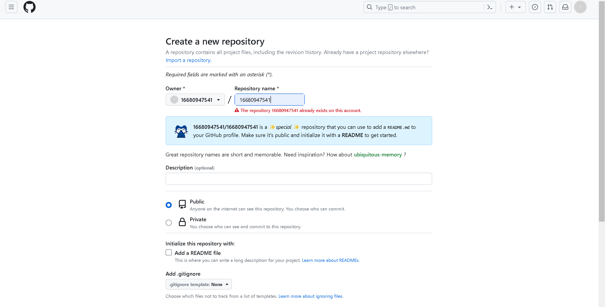
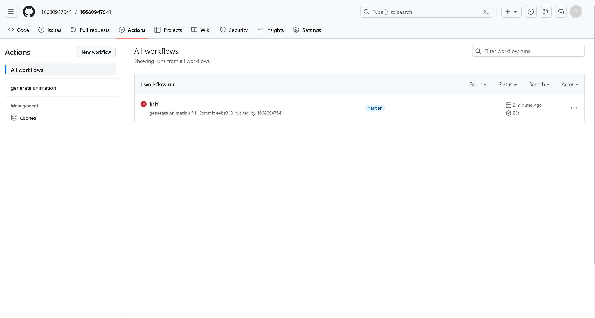
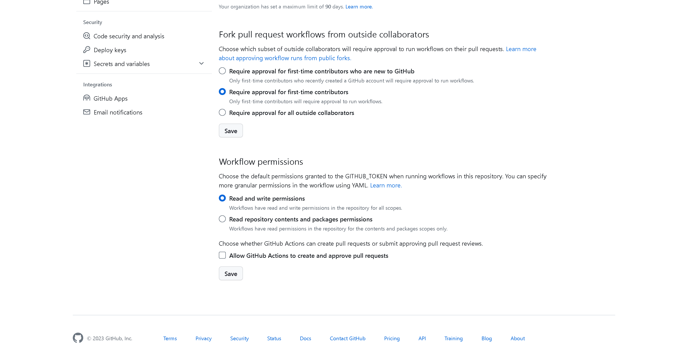
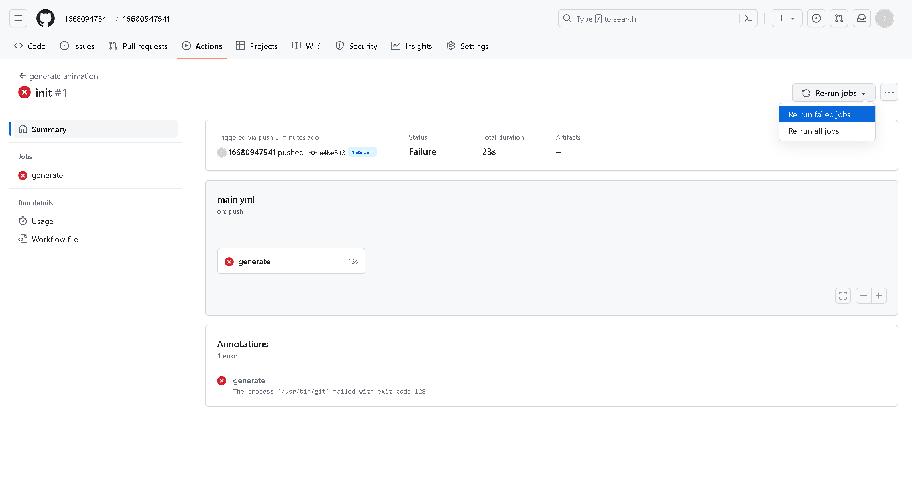

##### 在 github 的主页上显示贪吃蛇动画：

1. 先在 github 上创建一个新的仓库 (仓库名字与自己 github 名字一样)。我已经创建过了，注意它会提醒你：**16680947541/16680947541** is a ✨*special* ✨ repository that you can use to add a `README.md` to your GitHub profile. Make sure it’s public and initialize it with a **README** to get started.

   

2. 设置权限：必须是 public

3. 点击 Create repository 

4. 在本地克隆一下 git clone git@github.com:16680947541/16680947541.git

5. 将 README.md 文件中的 16680947541 改成自己的 名字

   ```html
   <picture>
     <source media="(prefers-color-scheme: dark)" srcset="https://raw.githubusercontent.com/16680947541/16680947541/output/github-contribution-grid-snake-dark.svg">
     <source media="(prefers-color-scheme: light)" srcset="https://raw.githubusercontent.com/16680947541/16680947541/output/github-contribution-grid-snake.svg">
     
   </picture>
   ```

6. 第一次 push 上出会报错, 需要在 Settings 中点 Actions 然后点 General 

   

7. 然后修改一下 Workflow permissions 权限, 将它改成 Read and write permissions 保存

   

8. 最后点 Actions, 点击报错信息，重新运行一下。

   

9. 等待一下，就 OK 了。

   